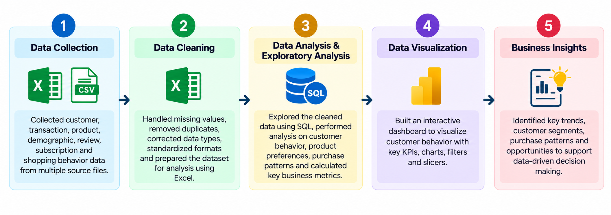

# Customer Behavior Analysis

## Problem Statement

Understanding customer purchasing behavior is important for businesses to improve sales, customer retention, product strategy, and promotional decisions. However, customer, transaction, product, demographic, discount, subscription, and review information can be difficult to evaluate when it is not analyzed systematically.

The challenge is to transform customer shopping data into meaningful insights about who the customers are, what they purchase, how much they spend, how purchasing behavior differs across customer groups and locations, and how factors such as discounts, subscriptions, reviews, and previous purchases relate to customer behavior.

## Objective

- Analyze customer purchasing behavior and identify important behavioral patterns.
- Understand customer demographics and purchasing characteristics.
- Identify the most purchased and highest-revenue product categories and products.
- Compare customer and revenue distribution across different locations.
- Examine the relationship between discounts and customer spending.
- Segment customers based on their previous purchase behavior.
- Analyze subscription behavior among repeat customers.
- Evaluate revenue contribution across different age groups.
- Analyze purchasing patterns across age groups, product categories, and seasons.
- Convert the analysis into an interactive dashboard for easier business interpretation.

## Project Workflow

**Data Collection → Data Cleaning → Data Analysis & Exploratory Analysis → Data Visualization → Business Insights**

## Approach

### 1. Data Collection

Collected customer shopping data containing information related to:

- Customer demographics
- Products and categories
- Purchase amounts
- Purchase history
- Locations
- Discounts
- Subscription status
- Review ratings
- Seasons

### 2. Data Cleaning

Prepared the raw dataset for analysis by:

- Handling missing values
- Removing duplicate records
- Correcting data types
- Standardizing inconsistent formats
- Cleaning unnecessary spaces and inconsistencies
- Preparing the cleaned dataset for analysis

### 3. Data Analysis & Exploratory Analysis

Performed exploratory analysis to answer key business questions, including:

- Customer demographics and age distribution
- Gender-wise customer distribution
- Most purchased product categories
- Revenue by product category
- Most purchased products
- Highest-revenue products
- Customer and revenue distribution by location
- Spending behavior of customers using discounts
- Products with high review ratings
- Products frequently purchased with discounts
- Customer segmentation based on previous purchases
- Top products within each category
- Subscription behavior among repeat buyers
- Revenue contribution by age group
- Purchasing behavior across age groups, categories, and seasons

### 4. Data Visualization

Built an interactive Power BI dashboard to present the analyzed customer behavior data through:

- Key performance indicators
- Customer and revenue summaries
- Product and category comparisons
- Customer segmentation
- Demographic analysis
- Interactive filters and slicers

### 5. Business Insights

Used the analysis to identify meaningful customer and purchasing patterns and convert them into information that can support business decisions related to products, customers, promotions, subscriptions, and sales.

## Solution

The project provides a consolidated view of customer purchasing behavior and addresses the problem of analyzing customer data across multiple dimensions.

The analysis helps identify:

- **Customer segments:** Customers are categorized as New, Returning, or Loyal based on their previous purchase history, providing a clearer view of customer engagement levels.

- **Product demand:** Purchase frequency and revenue are compared across products and categories to identify products that contribute strongly to customer demand and sales.

- **Customer spending:** Purchase amounts are analyzed to understand overall spending behavior and identify customers who continue to spend above the average even when discounts are applied.

- **Discount behavior:** Discount usage is examined across products and customers to understand where promotional activity is more common and how it relates to purchasing behavior.

- **Subscription behavior:** Repeat customers are analyzed separately to understand subscription patterns among customers with higher previous-purchase activity.

- **Demographic behavior:** Revenue contribution is compared across age groups to identify which customer groups contribute more to overall revenue.

- **Geographical behavior:** Customer counts and revenue are compared across locations to identify stronger customer and revenue markets.

- **Seasonal purchasing:** Age groups, product categories, seasons, and revenue are analyzed together to identify differences in purchasing behavior across customer groups and seasons.

- **Customer preferences:** Product purchase frequency and review ratings provide a view of customer demand and product perception.

The final solution transforms raw customer shopping data into a structured customer behavior analysis that helps businesses understand **who their customers are, what they buy, how they spend, how they respond to discounts and subscriptions, and which customer and product segments contribute to revenue.**

## Dashboard

